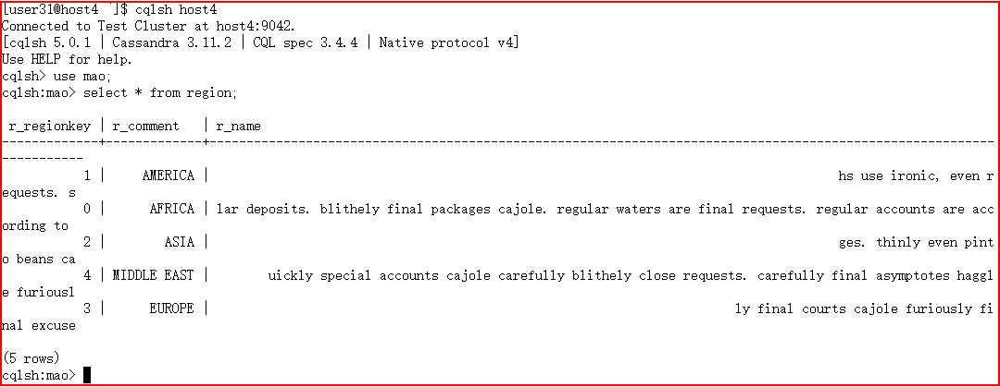

# Spark从文本文件中读取数据并写入到cassandra中
## <a href="pom.xml">1.pom.xml</a>
## 2.代码： 
```scala
package com.mao

import org.apache.spark.sql.SparkSession
import org.apache.spark.sql.cassandra._
import com.datastax.spark.connector.cql.CassandraConnectorConf


object CassandraLoadData {
  case class REGION (r_regionkey:Int,  r_comment:String, r_name:String)
  def main(args: Array[String]): Unit = {

    val path=args(1)
    val spark=SparkSession
      .builder()
      .appName("Cassandra Load Data")
      .master(args(0))
      .getOrCreate()

    spark.setCassandraConf(CassandraConnectorConf.KeepAliveMillisParam.option(10000))
    //指定cassandra集群的地址
    spark.setCassandraConf(CassandraConnectorConf.ConnectionHostParam.option("192.168.5.29"))

    import spark.implicits._
    //通过参数传入文件地址，本地或者hdfs中,注意使用"\\|"，这里需要转义的
    val regionDF=spark.sparkContext
      .textFile(path+"/region1.tbl")
      .map(_.split("\\|"))
      .map(temp=>REGION(temp(0).trim.toInt,temp(1),temp(2)))
      .toDF()
    regionDF.printSchema()
    regionDF.show()

    //DataFrame==>cassandra表
    //以下，"region"是表的名字，"mao"是keyspace(相当于数据库的名字)
    regionDF.write.cassandraFormat("region","mao").save()

    spark.stop()

  }
}
```

## 3.使用maven打包
## 4.向集群提交(<a href="Cassandra-CQL.md">提前在cassandra中新建KEYSPACE和表格</a>)：
```
spark-submit  --name "Cassandra Load Data" --class com.mao.CassandraLoadData --jars "/home/user31/spark-cassandra-connector_2.11-2.3.0.jar,/home/user31/jsr166e-1.1.0.jar" /home/user31/SparkExamples-1.0-SNAPSHOT.jar "spark://host4:7077" "hdfs://192.168.5.29:9000/user"
```
**注意以上，spark-submit的--jars有多个jar包需要传入的话，是需要使用逗号“,”来进行分割的**

## 4.结果：
</br>