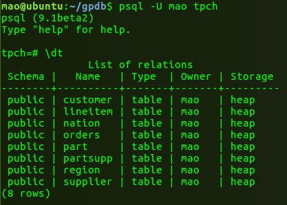

# GreenPlum-SQL

Ninja
```
$ git clone git://github.com/ninja-build/ninja.git && cd ninja
$ git checkout release
$ cat README
 ./configure.py --bootstrap
 cp ninja /usr/local/lib
```
---
gp-xerces
```
git clone https://github.com/greenplum-db/gp-xerces.git
mkdir build
cd build
../configure --prefix=/usr/local
make
make install
```
---
Build and install GPORCA
```
git clone https://github.com/greenplum-db/gporca.git
cd gporca
cmake -GNinja -H. -Bbuild
ninja install -C build
```
---


GreenPlum
```
# GreenPlum下载:
git clone https://github.com/greenplum-db/gpdb.git

# ubuntu
./README.ubuntu.bash
add-apt-repository ppa:ubuntu-toolchain-r/test -y
apt-get update
apt-get install -y gcc-6 g++-6

# Make sure that you add /usr/local/lib to /etc/ld.so.conf, then run command ldconfig.
# gpdb_src/concourse/scripts/setup_gpadmin_user.bash

############################################################
sudo bash -c 'cat >> /etc/sysctl.conf <<-EOF
kernel.shmmax = 500000000
kernel.shmmni = 4096
kernel.shmall = 4000000000
kernel.sem = 250 512000 100 2048
kernel.sysrq = 1
kernel.core_uses_pid = 1
kernel.msgmnb = 65536
kernel.msgmax = 65536
kernel.msgmni = 2048
net.ipv4.tcp_syncookies = 1
net.ipv4.ip_forward = 0
net.ipv4.conf.default.accept_source_route = 0
net.ipv4.tcp_tw_recycle = 1
net.ipv4.tcp_max_syn_backlog = 4096
net.ipv4.conf.all.arp_filter = 1
net.ipv4.ip_local_port_range = 1025 65535
net.core.netdev_max_backlog = 10000
net.core.rmem_max = 2097152
net.core.wmem_max = 2097152
vm.overcommit_memory = 2

EOF'

sudo bash -c 'cat >> /etc/security/limits.conf <<-EOF
* soft nofile 65536
* hard nofile 65536
* soft nproc 131072
* hard nproc 131072

EOF'

sudo bash -c 'cat >> /etc/ld.so.conf <<-EOF
/usr/local/lib

EOF'
#########################################################

# Configure build environment to install at /usr/local/gpdb
./configure --with-perl --with-python --with-libxml --with-gssapi --prefix=/usr/local/gpdb

# Compile and install
make -j8
make -j8 install

# Bring in greenplum environment into your running shell

source /usr/local/gpdb/greenplum_path.sh

# Start demo cluster
make create-demo-cluster
# (gpdemo-env.sh contains __PGPORT__ and __MASTER_DATA_DIRECTORY__ values)

source gpAux/gpdemo/gpdemo-env.sh
```
---
<a href="http://greenplum.org/gpdb-sandbox-tutorials/create-tables/#ffs-tabbed-11|ffs-tabbed-21">psql测试</a>
```
source /usr/local/gpdb/greenplum_path.sh
source /home/mao/gpdb/gpAux/gpdemo/gpdemo-env.sh
gpstart #正常启动
gpstop #正常关闭
gpstop -M fast #快速关闭
gpstop –r #重启
gpstop –u #重新加载配置文件

# 新建用户
$ createuser -P user1
template1=# CREATE USER user2 WITH PASSWORD 'pivotal' NOSUPERUSER;
template1=# CREATE ROLE users;
template1=# GRANT users TO user1, user2;
template1=# \du
template1=# \q

# 使用sql建表
tutorial=# \i create_dim_tables.sql
# 列举表格
tutorial=# \dt
```
# 建表并加载数据
## <a href="./greenplum_createtables.sql">建表</a>
## <a href="./greenplum_preprocess.sh">数据清洗(去掉.tbl文本最后一个'|'字符)</a>
## <a href="./greenplum_loaddata.sql">加载数据</a>
# 效果

