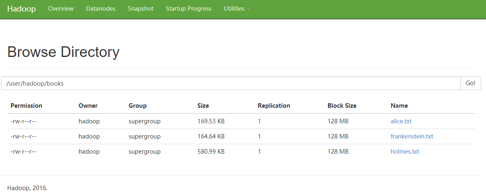

# 集群搭建
## 一、hadoop
### (一) 准备三台机器
```
node-master:192.168.139.131
node1:192.168.139.132
node2:192.168.139.133
```

### (二) 修改每一个机器的/etc/hosts


<font color="red">**如何使用脚本批量修改机器的/etc/hosts?**</font>

### (三) 分发ssh(Distribute Authentication Key-pairs for the Hadoop UserPermalink)
```
# 在node-master节点下执行操作
ssh-keygen -b 4096
ssh-copy-id -i $HOME/.ssh/id_rsa.pub hadoop@node-master
ssh-copy-id -i $HOME/.ssh/id_rsa.pub hadoop@node1
ssh-copy-id -i $HOME/.ssh/id_rsa.pub hadoop@node2
```
### (四) java+hadoop
版本：<br/>
- 修改环境变量：/home/hadoop/.profile,添加如下：
```sh
export JAVA_HOME=/home/hadoop/app/java/jdk1.8.0_171
export HADOOP_HOME=/home/hadoop/app/hadoop-2.6.5
export PATH="$HOME/bin:$HOME/.local/bin:$JAVA_HOME/bin:$HADOOP_HOME/sbin:$HADOOP_HOME/bin:$PATH"
```


<font color='red' size='4'>以上，如何使用脚本批量进行修改，包含一些确认和密码输入问题？</font></br>

#### <font color="green">**最重要的配置文件如下：**</font>
<p align="center">`~/hadoop/etc/hadoop/core-site.xml`</p>
```
<?xml version="1.0" encoding="UTF-8"?>
<?xml-stylesheet type="text/xsl" href="configuration.xsl"?>
    <configuration>
        <property>
            <name>fs.default.name</name>
            <value>hdfs://node-master:9000</value>
        </property>
    </configuration>
```
---
<p align="center">`~/hadoop/etc/hadoop/hdfs-site.xml`</p>
```
<configuration>
    <property>
            <name>dfs.namenode.name.dir</name>
            <value>/home/hadoop/data/nameNode</value>
    </property>

    <property>
            <name>dfs.datanode.data.dir</name>
            <value>/home/hadoop/data/dataNode</value>
    </property>

    <property>
            <name>dfs.replication</name>
            <value>1</value>
    </property>
</configuration>
```
---
<p align="center">`~/hadoop/etc/hadoop/mapred-site.xml`</p>
```
<configuration>
    <property>
            <name>mapreduce.framework.name</name>
            <value>yarn</value>
    </property>
    <property>
          <name>yarn.app.mapreduce.am.resource.mb</name>
          <value>512</value>
    </property>

<property>
        <name>mapreduce.map.memory.mb</name>
        <value>256</value>
</property>

<property>
        <name>mapreduce.reduce.memory.mb</name>
        <value>256</value>
</property>


</configuration>
```
---
<p align="center">`~/hadoop/etc/hadoop/yarn-site.xml`</p>
```
<configuration>
    <property>
            <name>yarn.acl.enable</name>
            <value>0</value>
    </property>

    <property>
            <name>yarn.resourcemanager.hostname</name>
            <value>node-master</value>
    </property>

    <property>
            <name>yarn.nodemanager.aux-services</name>
            <value>mapreduce_shuffle</value>
    </property>
    <property>
            <name>yarn.nodemanager.resource.memory-mb</name>
            <value>1536</value>
    </property>

    <property>
          <name>yarn.scheduler.maximum-allocation-mb</name>
          <value>1536</value>
    </property>

    <property>
          <name>yarn.scheduler.minimum-allocation-mb< /name>
          <value>128</value>
    </property>

    <property>
          <name>yarn.nodemanager.vmem-check-enabled</name>
          <value>false</value>
    </property>
</configuration>
```
---
<p align="center">`~/hadoop/etc/hadoop/slaves`</p>
```
node1
node2
```
---
### (五)从node-master使用scp分发到node1，node2
```
# 以下拷贝了整个目录，不是很科学，科学做法是在每一个机器上下好文件，仅仅scp配置文件
for node in node1 node2; do
    scp /home/hadoop/.profile $node:/home/hadoop
    scp ~/hadoop/etc/hadoop/* $node:/home/hadoop/hadoop/etc/hadoop/;
done
```
---
<a href="resource/hadoop">配置文件</a>

### (六) 使用
1.在node-master机器上：
```sh
# 不要多次format，多次会导致DataNode无法启动（当然有解决方案）
hdfs namenode -format
# 启动集群，在浏览器中输入192.168.139.131查看集群状态
start-dfs.sh
```


2.在node1节点上：
```sh
hdfs dfs -mkdir -p /user/hadoop
hdfs dfs -mkdir books
# 下载文件
cd /home/hadoop
wget -O alice.txt https://www.gutenberg.org/files/11/11-0.txt
wget -O holmes.txt https://www.gutenberg.org/ebooks/1661.txt.utf-8
wget -O frankenstein.txt https://www.gutenberg.org/ebooks/84.txt.utf-8
# 上传文件
hdfs dfs -put alice.txt holmes.txt frankenstein.txt books
# 查看dfs文件目录
hdfs dfs -ls books
```


3.使用yarn
```
# 启动
start-yarn.sh
# 停止
stop-yarn.sh
# 访问192.168.139.131:8088
```


## 二、spark
## 三、Cassandra
## 四、GreenPlum

## 参考资料
- <a href="https://www.linode.com/docs/databases/hadoop/how-to-install-and-set-up-hadoop-cluster/">hadoop cluster搭建</a>

- 环境变量模板

```sh
export JAVA_HOME=/home/mao/java/jdk1.8.0
export SCALA_HOME=/home/mao/scala/scala-2.11.12
export HADOOP_HOME=/home/mao/Apache/hadoop-2.6.5
export HBASE_HOME=/home/mao/Apache/hbase-0.98.8
export CLASSPATH=.:$JAVA_HOME/lib:$JAVA_HOME/jre/lib:$CLASSPATH
export HIVE_HOME=/home/mao/Apache/hive-1.2.2
export MAVEN_HOME=/home/mao/Apache/maven-3.5.3
export SPARK_HOME=/home/mao/Apache/spark-2.3.0-bin-hadoop2.6
export CASSANDRA_HOME=/home/mao/Apache/apache-cassandra-3.11.2
export PATH=$JAVA_HOME/bin:$JAVA_HOME/jre/bin:$SCALA_HOME/bin:$HADOOP_HOME/sbin:$HADOOP_HOME/bin:$HBASE_HOME/bin:$HIVE_HOME/bin:$MAVEN_HOME/bin:$SPARK_HOME/bin:$CASSANDRA_HOME/bin:$PATH
```
